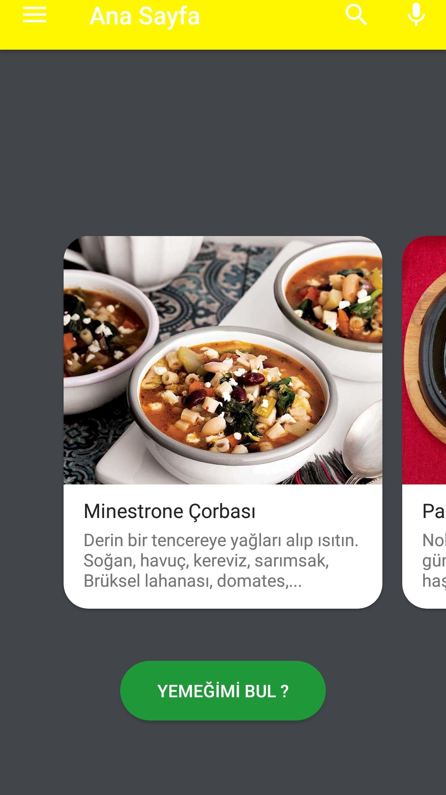
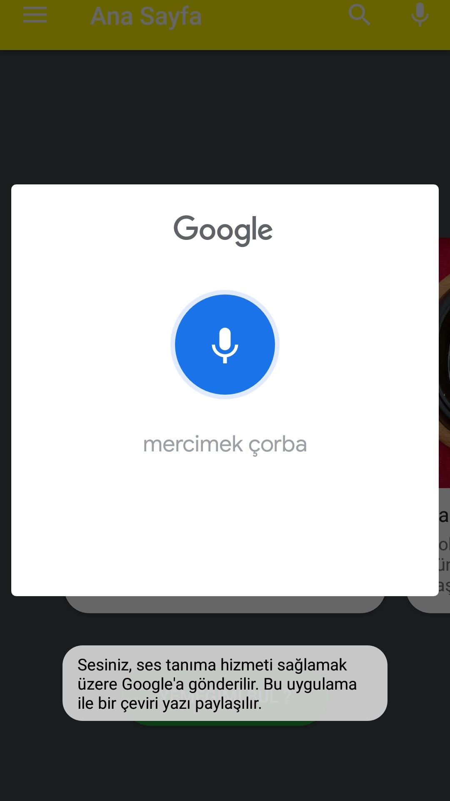
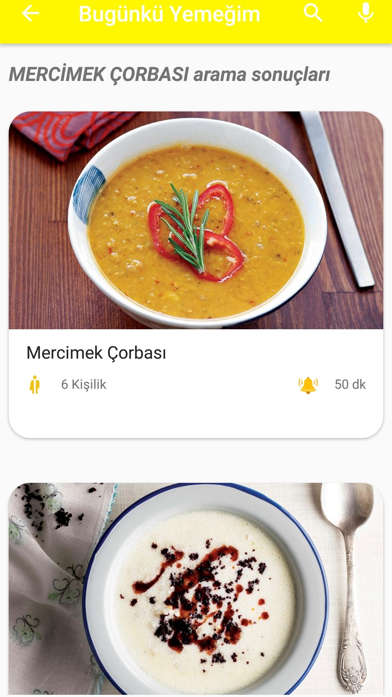
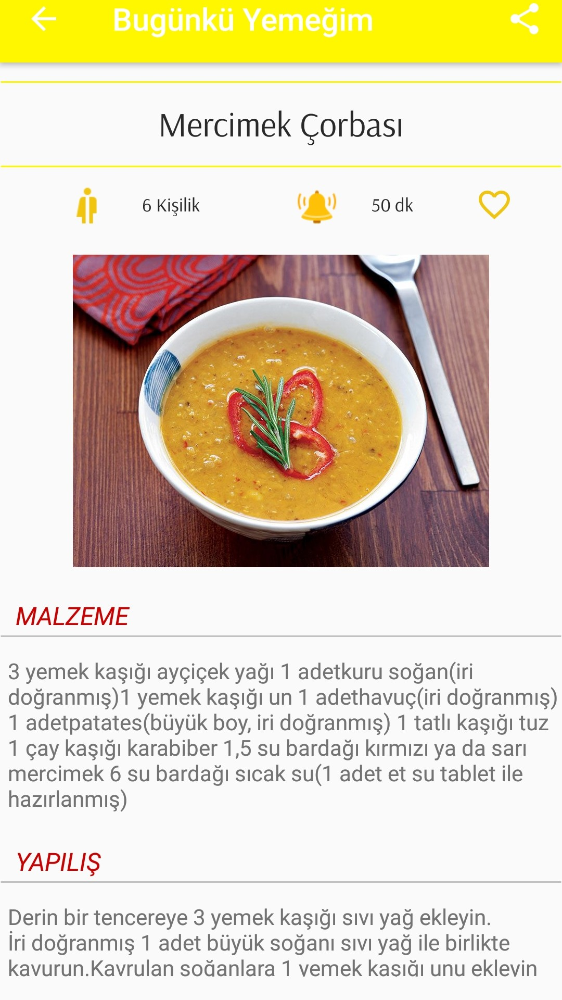
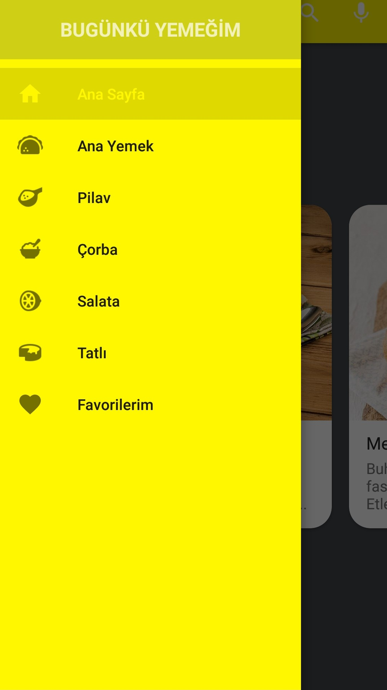
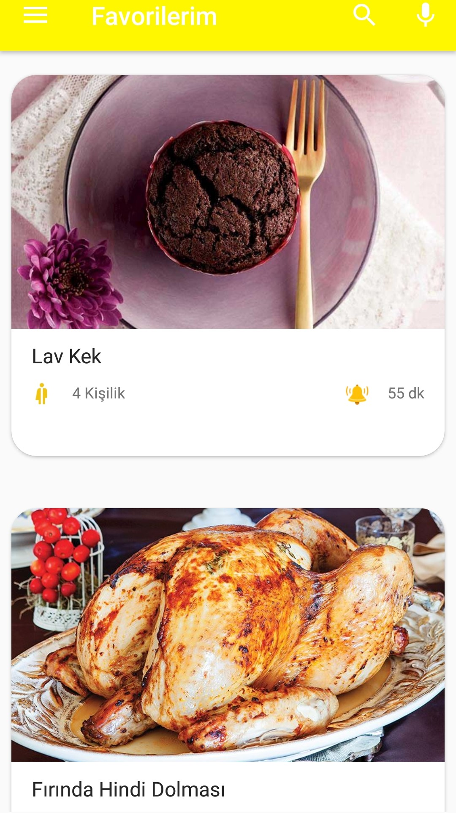
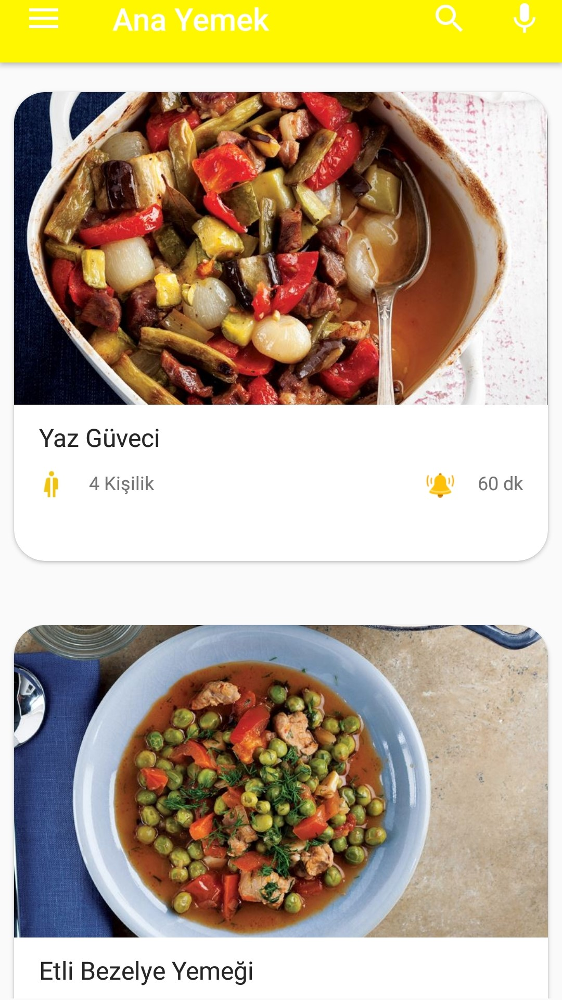

# Content #

# About Projects #

### Screenshots ###
                              

### Abstract ###

I decided to make the Food app to use the new technologies of Android and improve myself. When I started doing this application, there were technologies that I used for the first time. This situation forced me a lot. I got involved in continuous research and received help from various question and answer platforms. I would like to thank everyone separately. I am sharing this project with you as open source. If you have a chance to review the code structure, don't forget to send your advice to me. When I finished this project, I learned very good experiences. This made me very happy. Now I started to roll up my sleeves to start my next project.

### Project Details ###

In this food application construction,I am using my own api.when we log in to the application,When the permit processes are positive, we come to the home page first.We can find random meal or we can change.Dishes can be listed according to the categories from the menu. We can reach the recipe of the food we want and share it with our friends. While finding a meal, google assistant or regular search can be used.

### How Can I Use ###

just download the program.

### Libraries and tools ###

* [RxJava](https://github.com/ReactiveX/RxJava)
* [Retrofit](https://square.github.io/retrofit/)
* [Cardview](https://developer.android.com/guide/topics/ui/layout/cardview)
* [Picasso](https://square.github.io/picasso/)
* [Fragments](https://developer.android.com/guide/components/fragments)
* [SharedPreferences](https://developer.android.com/reference/android/content/SharedPreferences)
* [Navigation](https://developer.android.com/guide/navigation)

# Design #

I tried to make the design as good as I could for me

# Contact #

* [Linkedin](https://www.linkedin.com/in/recep-ye%C5%9Filkaya-59b5ba173/)

